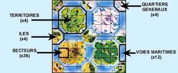
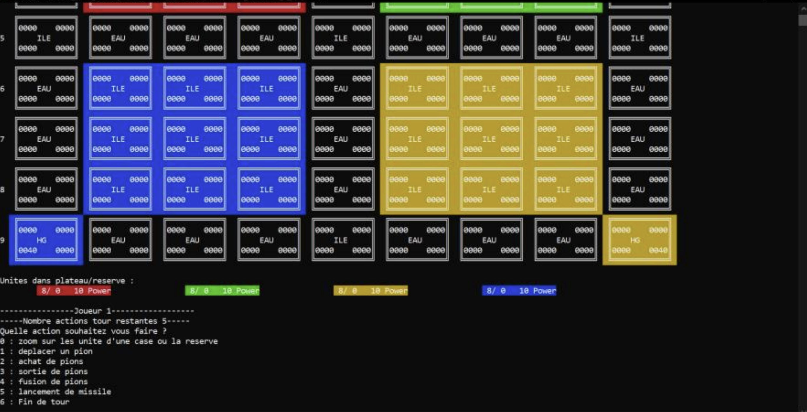

<h1 align="center">
  
</h1>
---

## Petit résumé

- Vous avez deux heures pour atteindre votre objectif.
Conquérire toutes les bases ennemies. Déployer l'ensemble de vos effectifs et menez le combat sur tous les fronts: terrestre, maritime et aérien.
Toutes vos actions doivent tendre vers un seul but: accroître la puissance de votre armée, car la victoire est à ce prix!
Ce jeu vous met dans la peau d'un grand stratège: vous allez planifier vos manoeuvres, prévoir les attaques de l'ennemi et déjouer au mieux ses pièges.

## Objectifs

- Prédire les classes d’un ensemble de données d'iris.
- Avoir la meillieur accuracy possible tout en évitant l'overfitting.

## Techno

- C++
- CodeBlocks

## UI
<h1 align="center">
  
</h1>

## Auteur

- [@Clemcaporal](https://github.com/clemcaporal)
- [@Alan9876](https://github.com/ALAN9876)