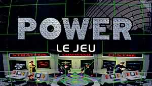

<h1 align="center">
  
</h1>

---

## Petit résumé

- Conquérir toutes les bases ennemies en moins de 2 heures pour atteindre votre objectif. Déployer l'ensemble de vos effectifs et menez le combat sur tous les fronts: terrestres, maritimes et aériens. Toutes vos actions doivent tendre vers un seul but: accroître la puissance de votre armée car la victoire est à ce prix!
Ce jeu vous met dans la peau d'un grand stratège: vous allez planifier vos manoeuvres, prévoir les attaques de l'ennemi et déjouer au mieux ses pièges.

<h1 align="center">
  
</h1>

## Objectifs

- Créer une application capable de jouer à POWER.

## Techno

- C++
- CodeBlocks

## UI
<h1 align="center">
  
</h1>

## Auteur

- [@Clemcaporal](https://github.com/clemcaporal)
- [@Alan9876](https://github.com/ALAN9876)
